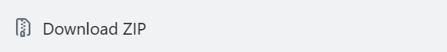
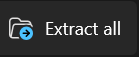

# Performing-Arts-Brand-Task
## Install guide
Go into this main repository. Click this button labeled \<code\>.

</img>

Click download zip.

</img>

Open the file in Windows File Explorer and click Extract All and place it somewhere on your computer.

</img>

Lastly just double click the file called index.html. If you only see index, click the one with the icon that looks like your browser.

</img>
